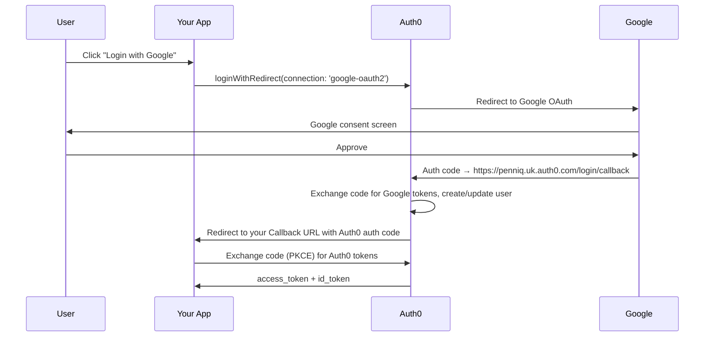

# Social Login with Google (Auth0)

## Cost

Google OAuth 2.0 sign-in is **free** — no per-user cost, no MAU limit, no rate limit from Google's side. The only cost is on Auth0's side (each Google login counts as an Auth0 MAU).

## Setup Steps

1. Go to [Google Cloud Console](https://console.cloud.google.com/)
2. Create a project (free)
3. Enable the **OAuth consent screen** (APIs & Services > OAuth consent screen)
4. Create **OAuth 2.0 Client ID** credentials (APIs & Services > Credentials > Create Credentials > OAuth Client ID)
   - Application type: **Web application**
   - Authorized redirect URI: `https://penniq.uk.auth0.com/login/callback`
5. Copy the **Client ID** and **Client Secret** into Auth0 Dashboard > Authentication > Social > Google

## Google Services: Free vs Paid

| Service | Cost |
|---|---|
| **OAuth 2.0 sign-in (OpenID Connect)** | Free, unlimited |
| **Google APIs** (Drive, Calendar, Gmail, etc.) | Free tier with quotas, then pay-per-use |
| **Google Workspace admin APIs** | Requires Workspace subscription |
| **reCAPTCHA Enterprise** | Free tier, then per-assessment |

## Why Replace Auth0 Developer Keys

Auth0 provides built-in developer keys for quick testing, but they should **not** be used in production:

| Aspect | Auth0 Dev Keys | Your Own Google Credentials |
|---|---|---|
| **Consent screen** | Auth0-branded | Your app branding |
| **Request volume** | Limited | Google's standard quotas (generous) |
| **Scopes** | Fixed | Fully customizable |
| **Production use** | Not permitted (Auth0 ToS) | Allowed |
| **Setup time** | Instant | ~5 minutes |

## Auth0 Callback URL

When configuring the Google OAuth client, the authorized redirect URI must be:

```
https://penniq.uk.auth0.com/login/callback
```

This is Auth0's endpoint — Google redirects to Auth0 (not your app). Auth0 then redirects to your app's configured Callback URL (`http://localhost:4200` or `http://localhost:5173`).

## Flow


