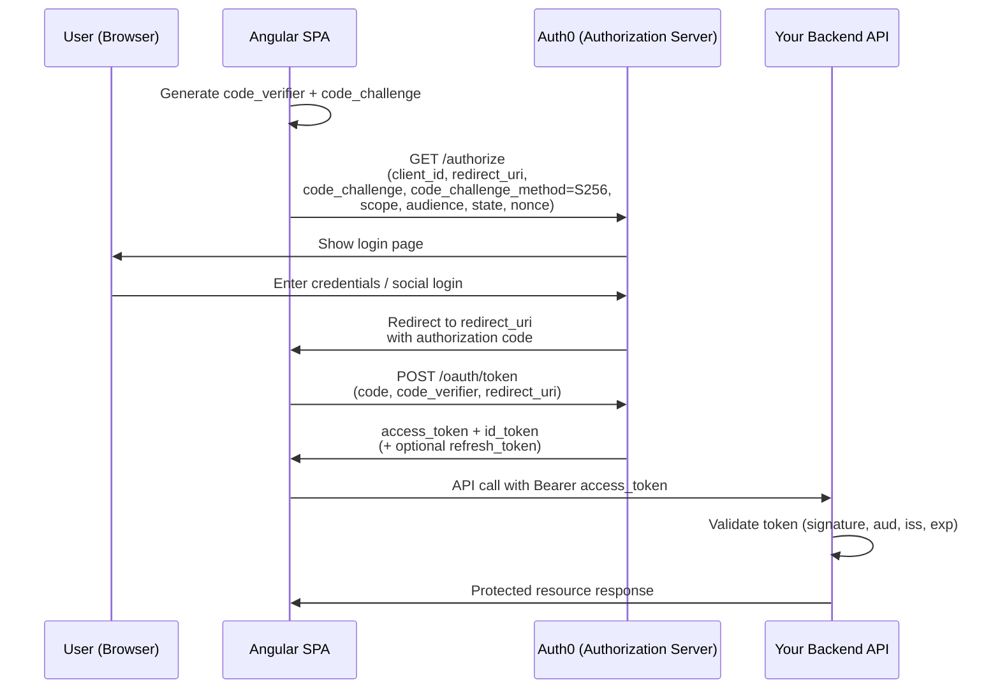
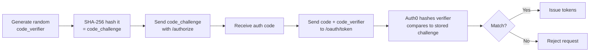
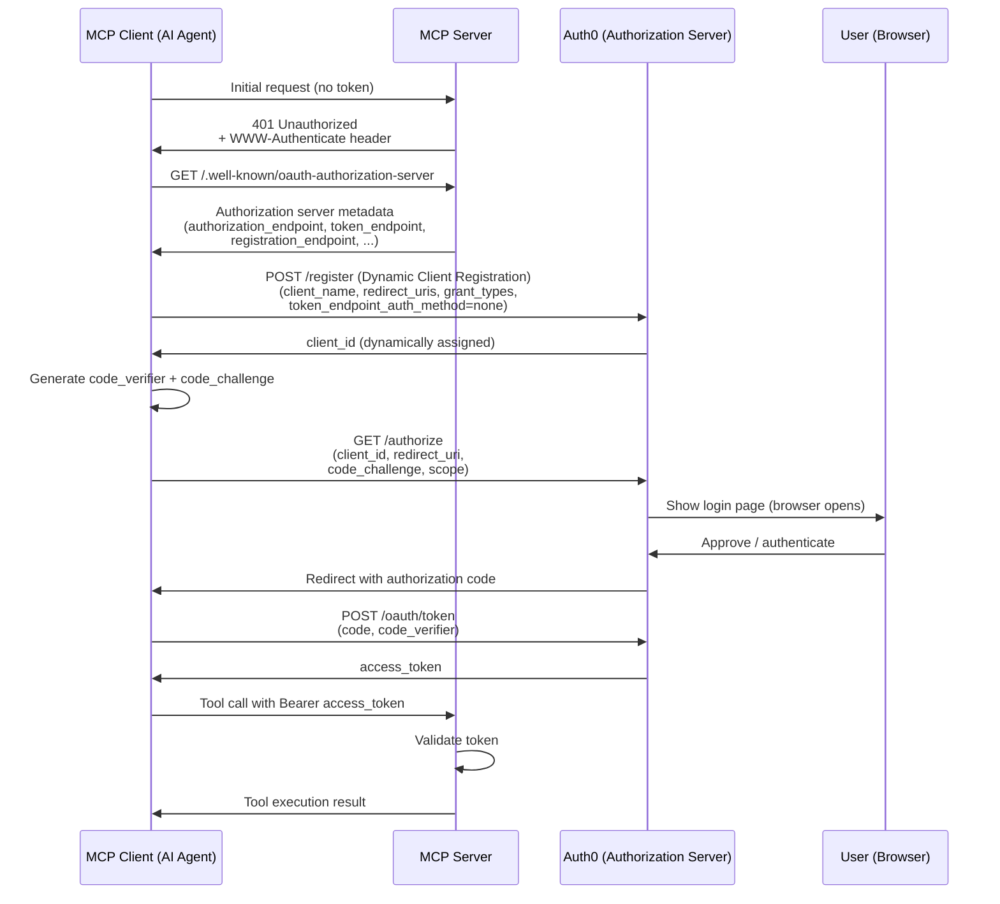
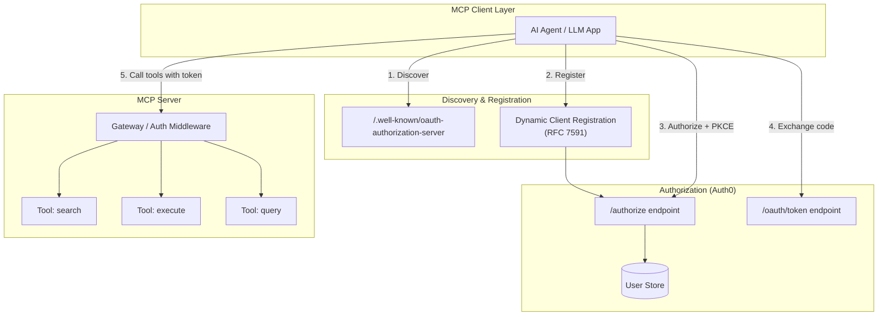
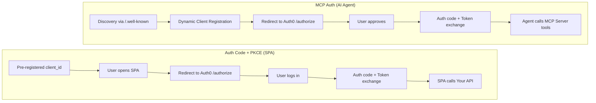
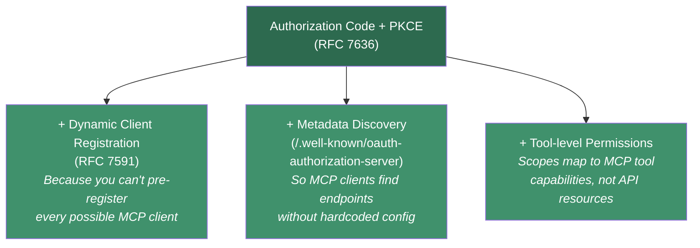
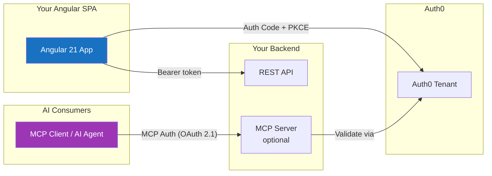
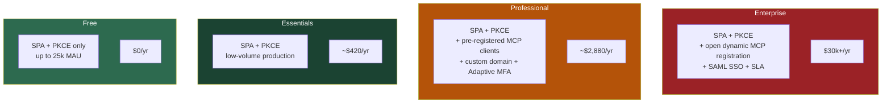

# Authorization Code Flow with PKCE vs MCP Auth (Auth0)

## Overview

This document compares two authentication approaches:

- **Authorization Code Flow with PKCE** — the standard OAuth 2.0 flow for public clients (SPAs, mobile apps, CLIs)
- **MCP Auth** — the authentication layer for Model Context Protocol servers, built on OAuth 2.1

Both use the same underlying mechanism (Authorization Code + PKCE), but they differ in **who authenticates**, **how clients are registered**, and **what consumes the tokens**.

---

## Authorization Code Flow with PKCE (OAuth 2.0 / 2.1)

The standard OAuth 2.0 flow for public clients defined in **RFC 7636**. PKCE (Proof Key for Code Exchange) replaces the client secret, which SPAs and native apps cannot keep safe.

### Flow Diagram

### Key Characteristics

| Aspect | Detail |
|---|---|
| **Spec** | OAuth 2.0 (RFC 6749) + PKCE (RFC 7636) |
| **Client type** | Public client (SPA) — pre-registered in Auth0 dashboard |
| **Who authenticates** | Human user via browser redirect |
| **Client registration** | Manual — configured in Auth0 tenant beforehand |
| **Token consumer** | Your own backend API |
| **Token storage** | In-memory (recommended), or secure cookie via BFF pattern |
| **PKCE** | Required for SPAs, prevents authorization code interception |

### PKCE Mechanism

---

## MCP Auth (Model Context Protocol + OAuth 2.1)

MCP Auth is the authentication layer for **MCP servers** — it defines how an AI agent or MCP client authenticates to a remote tool server. The MCP specification (2025-03-26 revision) adopted **OAuth 2.1** as its auth framework, which **mandates PKCE by default**.

### Flow Diagram

### Key Characteristics

| Aspect | Detail |
|---|---|
| **Spec** | OAuth 2.1 (PKCE mandatory) + RFC 7591 (Dynamic Client Registration) |
| **Client type** | Dynamically registered MCP client |
| **Who authenticates** | AI agent/client on behalf of a user |
| **Client registration** | Dynamic — MCP clients register themselves at runtime via RFC 7591 |
| **Discovery** | `/.well-known/oauth-authorization-server` metadata endpoint |
| **Token consumer** | MCP server (tool execution layer) |
| **Auth0's role** | Upstream IdP — can be the authorization server behind the MCP server |
| **PKCE** | Mandatory (OAuth 2.1 requirement) |

### MCP Auth Architecture

---

## Side-by-Side Comparison

| Aspect | PKCE (SPA to API) | MCP Auth (Agent to MCP Server) |
|---|---|---|
| **Who authenticates** | Human user via browser | AI agent/client on behalf of a user |
| **Client type** | Pre-registered SPA | Dynamically registered MCP client |
| **Specification** | OAuth 2.0 + RFC 7636 | OAuth 2.1 (PKCE mandatory) + RFC 7591 |
| **Client registration** | Manual (Auth0 dashboard) | Dynamic (RFC 7591 at runtime) |
| **Endpoint discovery** | Hardcoded Auth0 domain | `/.well-known/oauth-authorization-server` |
| **Token consumer** | Your backend API | MCP server (tool execution) |
| **Auth0's role** | Authorization server + user store | Upstream IdP behind MCP server |
| **Redirect flow** | Browser redirect | Browser redirect or out-of-band (CLI agents) |
| **Refresh tokens** | Optional (rotation recommended) | Typically short-lived, re-authorize on expiry |
| **Scope model** | Custom API scopes / permissions | MCP tool-level permissions |

---

## The Key Insight

MCP Auth **is not a different flow** — it is Authorization Code with PKCE underneath. What it adds on top:

1. **Dynamic Client Registration** — because you cannot pre-register every possible MCP client in your Auth0 tenant
2. **Metadata Discovery** — so MCP clients can locate endpoints without hardcoded configuration
3. **Standardized scope/capability model** — tied to MCP tool permissions rather than traditional API scopes

---

## What This Means for Your Angular SPA

| Scenario | What to use |
|---|---|
| Your SPA calls **your own API** | Standard Auth Code + PKCE with Auth0 |
| Your SPA connects to **MCP servers** (exposing tools to an AI agent) | The MCP server needs its own OAuth 2.1 endpoint, potentially backed by Auth0. The SPA itself does **not** use MCP Auth — the AI client does. |
| Your SPA is **both** an API consumer and an MCP host | Use PKCE for the user-facing auth; implement MCP Auth on the server side for agent consumers |

---

## Pricing Comparison (Auth0)

> **Disclaimer:** Auth0 (Okta Customer Identity Cloud) restructured pricing in 2024-2025. The figures below reflect the latest known pricing as of early 2025. Auth0's pricing page is dynamically rendered and cannot be scraped — **always verify at [auth0.com/pricing](https://auth0.com/pricing)** before making decisions.

The flows themselves don't have different per-request costs — the pricing difference comes from **what each flow consumes on your Auth0 bill**.

### Auth0 Plan Structure (2024-2025)

Auth0 now offers separate **B2C** (Customer Identity) and **B2B** (SaaS/Business Identity) tracks:

#### B2C Plans (Customer Identity)

| Feature | Free | Essentials | Professional | Enterprise |
|---|---|---|---|---|
| **Price** | $0 | From ~$35/mo (annual) | From ~$240/mo (annual) | Custom (typically $30k+/yr) |
| **MAU included** | Up to 25,000 | Starts at 500, scales with usage | Starts at 500, scales with usage | Custom |
| **Social Connections** | 2 | 2 | Unlimited | Unlimited |
| **M2M Tokens** | Small quota | Limited | Higher limits | Custom / Unlimited |
| **Custom Domains** | No | No | Yes | Yes |
| **Organizations** | No | No | Limited / Add-on | Yes |
| **Dynamic Client Registration** | No | No | No | **Yes** |
| **MFA** | Basic | Basic | Advanced (Adaptive MFA) | Full |
| **RBAC** | Yes | Yes | Yes | Yes |
| **Enterprise Connections (SAML/OIDC)** | No | No | Add-on | Yes |
| **Log Retention** | 2 days | 2 days | 10 days | 30 days |
| **SLA** | None | None | 99.9% | 99.99% |
| **Attack Protection** | Basic | Basic | Advanced | Full |

#### B2B Plans (SaaS / Business Identity)

B2B plans mirror the tier structure but include **Organizations** support from lower tiers, plus:

- Enterprise Connections (SAML/OIDC SSO) at lower tiers
- Organization-level branding and member invitation flows
- Self-service SSO and SCIM provisioning (added mid-2024)
- Priced higher per-MAU than B2C equivalents

### Billing Impact: PKCE vs MCP Auth

| Billing dimension | Auth Code + PKCE (SPA) | MCP Auth |
|---|---|---|
| **MAU count** | 1 MAU per human user who logs in | Same — each user who approves an MCP client also counts as 1 MAU |
| **Applications** | 1 SPA registered manually | N dynamically registered clients — each MCP client creates a new Application record |
| **Dynamic Client Registration** | Not needed | **Requires Enterprise tier** — not available on Free, Essentials, or Professional |
| **M2M tokens** | Typically not used | MCP servers may need M2M tokens for server-to-server validation — **separate hard limits per tier**, can be costly |
| **Token requests** | Proportional to users | Potentially higher — MCP clients may re-authorize more frequently (short-lived tokens, no refresh token strategy) |

### M2M Token Pricing (Critical for MCP)

M2M tokens are a common cost surprise. Auth0 charges separately for machine-to-machine token usage:

| Plan | M2M Tokens Included | Overage |
|---|---|---|
| **Free** | ~1,000/mo | Not available |
| **Essentials** | ~1,000/mo | Paid add-on |
| **Professional** | ~5,000/mo | Paid add-on |
| **Enterprise** | Custom / Unlimited | Negotiated |

> MCP servers that validate tokens against Auth0 or call the Management API consume M2M tokens. At scale, this can exceed included quotas quickly.

### The Dynamic Client Registration Gate

The single biggest pricing differentiator for MCP Auth:

| Auth0 Plan | Dynamic Client Reg (RFC 7591) | Why it matters for MCP |
|---|---|---|
| **Free** | No | Cannot support open MCP client registration |
| **Essentials** | No | Same limitation |
| **Professional** | No | Same limitation |
| **Enterprise** | **Yes** | Required for open MCP Auth — minimum ~$30k+/yr |

> **Key takeaway:** MCP Auth with open dynamic registration **requires Enterprise**, which typically starts at **$30k+/year**. This is the single biggest pricing gap between the two flows.

### Cost by Scenario

| Scenario | Recommended plan | Estimated annual cost |
|---|---|---|
| SPA only, dev/prototype | **Free** (up to 25,000 MAU) | $0 |
| SPA only, low-volume production | **Essentials** | ~$420/yr |
| SPA + pre-registered MCP clients + custom domain | **Professional** | ~$2,880/yr |
| SPA + open dynamic MCP registration + SSO + SLA | **Enterprise** or self-host MCP auth | $30k+/yr or infra cost |

### Workarounds to Avoid Enterprise Pricing

If you want to support MCP clients without paying for Auth0 Enterprise:

1. **Proxy the registration** — build your own registration endpoint that creates Auth0 applications via the Management API. Stay on Professional, but you own the registration logic and rate limits.
2. **Pre-register known MCP clients** — if you control which AI agents connect, register them manually in the dashboard like any SPA. No dynamic registration needed, no Enterprise requirement.
3. **Separate authorization server for MCP** — use a self-hosted solution (Keycloak, ORY Hydra) for the MCP auth layer, keep Auth0 for your SPA users. Splits the bill.
4. **Use a different IdP for MCP** — AWS Cognito supports dynamic registration on its standard tier; could be a cheaper MCP auth backend.

> **Note:** Auth0 pricing changes frequently. The free tier MAU limit has historically varied (7,500 in some periods, 25,000 in others). Always verify current rates at [auth0.com/pricing](https://auth0.com/pricing) before making architectural decisions.

---

## References

- [RFC 6749 — OAuth 2.0 Authorization Framework](https://datatracker.ietf.org/doc/html/rfc6749)
- [RFC 7636 — Proof Key for Code Exchange (PKCE)](https://datatracker.ietf.org/doc/html/rfc7636)
- [RFC 7591 — OAuth 2.0 Dynamic Client Registration](https://datatracker.ietf.org/doc/html/rfc7591)
- [OAuth 2.0 Security Best Current Practice](https://datatracker.ietf.org/doc/html/draft-ietf-oauth-security-topics)
- [MCP Specification — Authorization](https://modelcontextprotocol.io/specification/2025-03-26/basic/authorization)
- [Auth0 — Authorization Code Flow with PKCE](https://auth0.com/docs/get-started/authentication-and-authorization-flow/authorization-code-flow-with-pkce)
